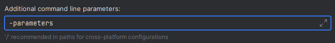

# Commands
!!! info
    If you're new to JDA and Discord Bots in general, please make yourself familiar with the
    [JDA wiki](https://jda.wiki/using-jda/interactions/) first. We assume that the basic structure of interactions is known.

## Slash Commands
SlashCommands are defined by annotating a method with [`@SlashCommand`](https://kaktushose.github.io/jda-commands/javadocs/latest/jda.commands/com/github/kaktushose/jda/commands/annotations/interactions/SlashCommand.html).
The first parameter must always be a [`CommandEvent`](https://kaktushose.github.io/jda-commands/javadocs/latest/jda.commands/com/github/kaktushose/jda/commands/dispatching/events/interactions/CommandEvent.html).
The name and other metadata of the command is passed to the annotation.
```java
@SlashCommand(value = "example", desc = "This is an example command")
public void onCommand(CommandEvent event) {...}
```

### Sub Commands & Sub Command Groups
In contrast to JDA, JDA-Commands doesn't differentiate between slash commands, sub command groups and sub commands.
JDA-Commands determines the type automatically based on the command names. 

Let's say we have the following commands in our moderation bot:
```java
@SlashCommand("delete")
public void onDeleteMessages(CommandEvent event) {...}

@SlashCommand("moderation warn")
public void onWarnMember(CommandEvent event) {...}

@SlashCommand("moderation kick")
public void onKickMember(CommandEvent event) {...}

@SlashCommand("moderation ban")
public void onBanMember(CommandEvent event) {...}
```
JDA-Commands will create a tree structure of these commands. A depth-first-search is then performed to determine which 
commands should be registered as a slash command, a sub command or a sub command group.
```
├── delete
└── moderation
    ├── warn
    ├── kick
    └── ban
```
??? tip "Debugging"
    JDA-Commands will log this tree on log-level `DEBUG`. This might help you with debugging, for example when command 
    doesn't show up.

In our example the following commands will be registered: 

- `/delete`
- `/moderation warn`
- `/moderation kick`
- `/moderation ban`

To simplify things, you can also use the [`@Interaction`](https://kaktushose.github.io/jda-commands/javadocs/latest/jda.commands/com/github/kaktushose/jda/commands/annotations/interactions/Interaction.html)
to add a base name to all slash commands in a command controller:
```java
@Interaction("moderation")
public class ModerationCommands {
    
    @SlashCommand("warn")
    public void onWarnMember(CommandEvent event) {...}

    @SlashCommand("kick")
    public void onKickMember(CommandEvent event) {...}

    @SlashCommand("ban")
    public void onBanMember(CommandEvent event) {...}
}
```

### Command Options
You can add command options by simply adding a parameter to the method.
```java
@SlashCommand("ban")
public void onBanMember(CommandEvent event, Member target, String reason, int delDays) {
    (...)
}
```
JDA-Commands will attempt to type adapt the 
command options. By default, all primitive types, user, member and role as well as text channel entities are 
supported. You can find a concrete list of all type adapters [here](https://kaktushose.github.io/jda-commands/javadocs/latest/jda.commands/com/github/kaktushose/jda/commands/dispatching/adapter/TypeAdapter.html).
You can also [register your own type adapters](TODO link).

The parameters will automatically be mapped to the correct option type. You can find this mapping 
[here](https://github.com/Kaktushose/jda-commands/blob/main/jda-commands/src/main/java/com/github/kaktushose/jda/commands/definitions/interactions/command/OptionDataDefinition.java#L57-L79).

#### Name & Description
Use the [`@Param`](https://kaktushose.github.io/jda-commands/javadocs/latest/jda.commands/com/github/kaktushose/jda/commands/annotations/interactions/Param.html)
annotation to set a name and a description for a command option. By default, the parameter name will be used as the
option name.
```java
@SlashCommand("ban")
public void onBanMember(CommandEvent event, 
                        @Param("The member to ban") Member target,
                        @Param("The reason to ban the member") String reason,
                        @Param(name = "deletion days", value = "The number of days to delete messages for") int delDays) {
    (...)
}
```
---
!!! danger inline end
    In order for JDA-Commands to use the parameter name as the command option name, you must enable the `-parameters`
    compiler flag.

=== "Maven"
    ```xml title="pom.xml"
    <plugin>
        <groupId>org.apache.maven.plugins</groupId>
        <artifactId>maven-compiler-plugin</artifactId>
        <configuration>
            <compilerArgs>
                <compilerArg>-parameters</compilerArg>
            </compilerArgs>
        </configuration>
    </plugin>
    ```

=== "Gradle (Kotlin DSL)"
    ```kotlin title="build.gradle.kts"
    tasks.withType<JavaCompile> {
        options.compilerArgs += "-parameters"
    }
    ```

=== "Gradle (Groovy DSL)" 
    ```groovy title="build.gradle"
    compileJava {
        options.compilerArgs << '-parameters'
    }
    ```

=== "IntelliJ"    
    If you compile your project with IntelliJ during development go to `Settings > Compiler > Java Compiler`
    and add the `-parameters` flag:

    
---

#### Optional
In order to make a command option optional, annotate the parameter with [`@Optional`](https://kaktushose.github.io/jda-commands/javadocs/latest/jda.commands/com/github/kaktushose/jda/commands/annotations/interactions/Optional.html).
You can also pass a default value that will be used (and type adapted) if no user input is present. 
```java
@SlashCommand("ban")
public void onBanMember(CommandEvent event, Member target, @Optional String reason, @Optional("7") int delDays) {
    (...)
}
```
!!! note
    Required options must be added before non-required options.

#### Choices
Use the [`@Choices`](https://kaktushose.github.io/jda-commands/javadocs/latest/jda.commands/com/github/kaktushose/jda/commands/annotations/interactions/Choices.html)
annotation to add choices to a command option:
```java
@SlashCommand("ban")
public void onBanMember(CommandEvent event, 
                        Member target, 
                        @Choices({"Harassment", "Scam", "Advertising"}) String reason, 
                        int delDays) {
    (...)
}
```

#### Auto Complete
!!! failure
    The Auto Complete API will be refactored soon. This wiki will cover Auto Complete as soon as the refactoring is done.

## Context Commands
Both types of context commands are defined by the same [`@ContextCommand`](https://kaktushose.github.io/jda-commands/javadocs/latest/jda.commands/com/github/kaktushose/jda/commands/annotations/interactions/ContextCommand.html)
annotation. The first parameter must always be a [`CommandEvent`](https://kaktushose.github.io/jda-commands/javadocs/latest/jda.commands/com/github/kaktushose/jda/commands/dispatching/events/interactions/CommandEvent.html).
The name and other metadata of the command is passed to the annotation.

### Message Context
For message context commands the second method parameter must be a [`Message`](https://docs.jda.wiki/net/dv8tion/jda/api/entities/Message.html)
and the `type` must be [`Command.Type.MESSAGE`](https://docs.jda.wiki/net/dv8tion/jda/api/interactions/commands/Command.Type.html#MESSAGE).
```java
@ContextCommand(value = "Delete this message", type = Command.Type.MESSAGE)
public void onDeleteMessage(CommandEvent event, Message target) { ... }
```

### User Context
For user context commands the second method parameter must be a [`User`](https://docs.jda.wiki/net/dv8tion/jda/api/entities/User.html)
and the `type` must be [`Command.Type.USER`](https://docs.jda.wiki/net/dv8tion/jda/api/interactions/commands/Command.Type.html#USER).
```java
@ContextCommand(value = "Ban this user", type = Command.Type.USER)
public void onBanMember(CommandEvent event, User user) { ... }
```

## Additional Settings
Both the [`@SlashCommand`](https://kaktushose.github.io/jda-commands/javadocs/latest/jda.commands/com/github/kaktushose/jda/commands/annotations/interactions/SlashCommand.html) 
annotation and the
[`@ContextCommand`](https://kaktushose.github.io/jda-commands/javadocs/latest/jda.commands/com/github/kaktushose/jda/commands/annotations/interactions/ContextCommand.html)
annotation share the following fields.

### isGuildOnly
Sets whether a command is only usable in a guild. This only has an effect if the command is registered [globally](#scope-guild-global-commands). 
The default value is `false`.
=== "Slash Command"
    ```java
    @SlashCommand(value = "example", isGuildOnly = true)
    public void onCommand(CommandEvent event) {...}
    ```

=== "Context Command"
    ```java
    @ContextCommand(value = "example", type = Command.Type.MESSAGE, isGuildOnly = true)
    public void onCommand(CommandEvent event, Message message) {...}
    ```

### isNSFW
Sets whether a command can only be executed in NSFW channels. The default value is `false`.
=== "Slash Command"
    ```java
    @SlashCommand(value = "example", isNSFW = true)
    public void onCommand(CommandEvent event) {...}
    ```

=== "Context Command"
    ```java
    @ContextCommand(value = "example",  type = Command.Type.MESSAGE, isNSFW = true)
    public void onCommand(CommandEvent event, Message message) {...}
    ```

### enabledFor
Sets the [`Discord Permissions`](https://docs.jda.wiki/net/dv8tion/jda/api/Permission.html)
a command will be enabled for. By default, a command will be enabled for every permission.
!!! danger
    Guild admins can modify these permissions at any time! If you want to enforce permissions or secure a critical command
    further you should use the permissions system of JDA-Commands. You can read more about it [here](TODO link).

=== "Slash Command"
    ```java
    @SlashCommand(value = "example", enabledFor = Permission.BAN_MEMBERS)
    public void onCommand(CommandEvent event) {...}
    ```

=== "Context Command"
    ```java
    @ContextCommand(value = "example", type = Command.Type.MESSAGE, enabledFor = Permission.BAN_MEMBERS)
    public void onCommand(CommandEvent event, Message message) {...}
    ```

### scope (Guild & Global Commands)
Sets whether a command should be registered as a `global` or as a `guild` command. The default value is `global`.
!!! note
    User installable apps are currently not supported by JDA-Commands.

=== "Slash Command"
    ```java
    @SlashCommand(value = "example", scope = CommandScope.GUILD)
    public void onCommand(CommandEvent event) {...}
    ```

=== "Context Command"
    ```java
    @ContextCommand(value = "example", type = Command.Type.MESSAGE, scope = CommandScope.GUILD)
    public void onCommand(CommandEvent event, Message message) {...}
    ```

When having guild scoped commands you have to use the [`GuildScopeProvider`](https://kaktushose.github.io/jda-commands/javadocs/latest/jda.commands/com/github/kaktushose/jda/commands/scope/GuildScopeProvider.html)
to tell JDA-Commands what guilds a command should be registered for. 

Let's say we have a paid feature in our bot:
!!! example
    ```java
    @SlashCommand(value = "paid feature", scope = CommandScope.GUILD)
    public void onCommand(CommandEvent event) {
        event.reply("Hello World!");
    }
    ```

We then need to implement a [`GuildScopeProvider`](https://kaktushose.github.io/jda-commands/javadocs/latest/jda.commands/com/github/kaktushose/jda/commands/scope/GuildScopeProvider.html)
to only register this command for guilds that have paid for that feature:
!!! example
    ```java
    public class PremiumGuildsProvider implements GuildScopeProvider {

        @Override
        public Set<Long> apply(CommandData commandData) {
            if (commandData.getName().equals("paid feature")) {
                // this is the place where you could also perform a database lookup
                return Set.of(1234567890L);
            }
            return Set.of();
        }
    }
    ```

Finally, we have to register our `PremiumGuildsProvider`. We can either pass it to the builder:
!!! example
    ```java
    JDACommands.builder()
        .guildScopeProvider(new PremiumGuildsProvider())
        .start(jda, Main.class);
    ```

or simply annotate the `PremiumGuildsProvider` class with [`@Implementation`](https://kaktushose.github.io/jda-commands/javadocs/latest/jda.commands/com/github/kaktushose/jda/commands/annotations/Implementation.html).
!!! note
    Using the [`@Implementation`](https://kaktushose.github.io/jda-commands/javadocs/latest/jda.commands/com/github/kaktushose/jda/commands/annotations/Implementation.html)
    annotation requires the guice integration (shipped by default). You can read more about it [here](../di.md).   