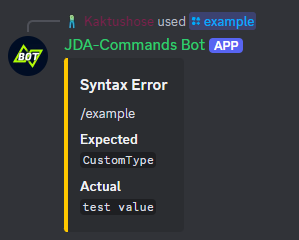

# Type Adapters
[`TypeAdapters`](https://kaktushose.github.io/jda-commands/javadocs/latest/jda.commands/com/github/kaktushose/jda/commands/dispatching/adapter/TypeAdapter.html)
are a part of the execution chain. They are used to adapt the input of a slash command to the correct type needed to invoke the method.

## Default Type Adapters
JDA-Commands provides the following type adapters by default:

- all primitive types and their respective wrapper types
- User
- Member
- Role
- Channel and subtypes (e.g. StageChannel, NewsChannel, etc.)

You can add any of these types as a parameter to your slash command methods. See [Command Options](../interactions/commands.md#command-options)
for details. These default types will be mapped to the most fitting option type. You can find the mapping [here](https://github.com/Kaktushose/jda-commands/blob/main/jda-commands/src/main/java/com/github/kaktushose/jda/commands/definitions/interactions/command/OptionDataDefinition.java#L57-L79).

## Writing Own Type Adapters

!!! example
    === "Command"
        ```java
        @SlashCommand("example")
        public void onCommand(CommandEvent event, CustomType object) {
            ...
        }
        ```

    === "Type Adapter (`@Implementation` Registration)"
        ```java
        @Implementation(clazz = CustomType.class)
        public class UserProfileTypeAdapter implements TypeAdapter<CustomType> {
            
            public Optional<CustomType> apply(String raw, GenericInteractionCreateEvent event) {
                return Optional.of(new CustomType(raw, event));
            }

        }
        ```

    === "Type Adapter (Builder Registration)"
        ```java
        public class UserProfileTypeAdapter implements TypeAdapter<CustomType> {
            
            public Optional<CustomType> apply(String raw, GenericInteractionCreateEvent event) {
                return Optional.of(new CustomType(raw, event));
            }

        }
        ```
        ```java
        JDACommands.builder(jda, Main.class)
            .adapter(CustomType.class, new UserProfileTypeAdapter());
            .start();
        ```

!!! tip
    If your type adapter is simple enough, you could also just use lambda expressions: 
    ```java
    JDACommands.builder(jda, Main.class)
        .adapter(CustomType.class, (raw, event) -> Optional.of(new CustomType(raw, event));
        .start();
    ```


Your own types will always be mapped to `OptionType.STRING`. If the type adapting fails (an empty `Optional` is returned)
an error message will be sent to the user:



_You can customize this error message, find more about it [here](../misc/error-messages.md)._
