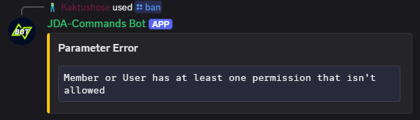

# Validators
Command Options of a Slash Command can have constraints. You can add constraints by annotating the method parameter
with the respective annotation. 

## Default Validators
JDA-Commands comes with the following default constraints:

- [`@Role`](https://kaktushose.github.io/jda-commands/javadocs/development/io.github.kaktushose.jda.commands.core/com/github/kaktushose/jda/commands/annotations/constraints/Role.html):
  The member must have the specified guild role. 
- [`@NotRole`](https://kaktushose.github.io/jda-commands/javadocs/development/io.github.kaktushose.jda.commands.core/com/github/kaktushose/jda/commands/annotations/constraints/NotRole.html):
  The member must **not** have the specified guild role. 
- [`@User`](https://kaktushose.github.io/jda-commands/javadocs/development/io.github.kaktushose.jda.commands.core/com/github/kaktushose/jda/commands/annotations/constraints/User.html):
  Must be the specified user or member
- [`@NotUser`](https://kaktushose.github.io/jda-commands/javadocs/development/io.github.kaktushose.jda.commands.core/com/github/kaktushose/jda/commands/annotations/constraints/NotUser.html):
  Must **not** be the specified user or member.
- [`@Perm`](https://kaktushose.github.io/jda-commands/javadocs/development/io.github.kaktushose.jda.commands.core/com/github/kaktushose/jda/commands/annotations/constraints/Perm.html):
  The user or member that have the specified discord permission.
- [`@NotPerm`](https://kaktushose.github.io/jda-commands/javadocs/development/io.github.kaktushose.jda.commands.core/com/github/kaktushose/jda/commands/annotations/constraints/NotPerm.html):
  The user or member that **doesn't** have the specified discord permission.

The user and role annotations will resolve the snowflake entity dynamically using the respective [type adapter](./typeadapter.md).
This means that you can either pass an ID or a name. 

!!! example
    ```java
    @SlashCommand("ban")
    public void onBan(CommandEvent event, @NotRole("Admin") Member target) {...}
    ```

An error message is sent, if a parameter constraint fails:



_You can customize this error message, find more about it [here](../misc/error-messages.md)._

## Writing own Validators

### 1. Creating the Annotation
First, you need to create an annotation type for your validator. Your annotation must meet the following conditions:

- [x] `@Target` must be `ElementType.PARAMETER`
- [x] `RetentionPolicy` must be `RUNTIME`
- [x] Must be annotated with [`@Constraint`](https://kaktushose.github.io/jda-commands/javadocs/latest/jda.commands/com/github/kaktushose/jda/commands/annotations/constraints/Constraint.html)
defining the valid types for this annotation. 
- [x] Must contain a `message()` field for the error message

!!! example
    ```java
    @Target(ElementType.PARAMETER)
    @Retention(RetentionPolicy.RUNTIME)
    @Constraint(String.class)
    public @interface MaxString {
        
        int value();

        String message() default "The given String is too long";
        
    }
    ```

### 2. Creating the Validator
Secondly, you must create the actual validator by implementing the [`Validator`](https://kaktushose.github.io/jda-commands/javadocs/latest/jda.commands/com/github/kaktushose/jda/commands/dispatching/validation/Validator.html)
interface. 

The `apply(...)` method will give you the argument (command option) as well as the annotation object untyped, you must cast
them on your own. If the constraint shall pass, you must return `true`, if it fails `false`. 

!!! example
    ```java
    public class MaxStringLengthValidator implements Validator {

        @Override
        public boolean apply(Object argument, Object annotation, InvocationContext<?> context) {
            MaxString maxString = (MaxString) annotation;
            return String.valueOf(argument).length() < maxString.value();
        }
    
    }
    ```

### 3. Registration
Lastly, you have to register your new validator.

!!! example
    === "`@Implementation` Registration"
        ```java
        @Implementation(annotation = MaxString.class)
        public class MaxStringLengthValidator implements Validator {
            ...
        }
        ```

    === "Builder Registration" 
        ```java
        JDACommands.builder(jda, Main.class)
            .validator(MaxString.class, new MaxStringLengthValidator());
            .start();
        ```
