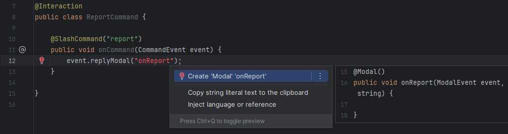

# Setup

## Prerequisites

- Java 23 or later
- [JDA 5.x](https://github.com/discord-jda/JDA)
- [SLF4J Implementation](https://jda.wiki/setup/logging/) _(not mandatory, but recommended)_

## Configuration
JDA-Commands is distributed through Maven Central. Alternatively you can download the latest version
[here](https://github.com/Kaktushose/jda-commands/releases/latest).

=== "Maven"
    ```xml title="pom.xml"
    <dependency>
       <groupId>io.github.kaktushose</groupId>
       <artifactId>jda-commands</artifactId>
       <version>4.0.0-beta.4</version>
    </dependency>
    ```
=== "Gradle (Kotlin DSL)"
    ```kotlin title="build.gradle.kts"
    repositories {
       mavenCentral()
    }
    dependencies {
       implementation("io.github.kaktushose:jda-commands:4.0.0-beta.4")
    }
    ```
=== "Gradle (Groovy DSL)"
    ```groovy title="build.gradle"
    repositories {
       mavenCentral()
    }
    dependencies {
       implementation 'io.github.kaktushose:jda-commands:4.0.0-beta.4"'
    }
    ```

## IntelliJ Plugin

We also provide an IntelliJ Plugin that performs some Code Inspection. It validates method references, which are 
commonly used in jda-commands. You can find it [here](https://plugins.jetbrains.com/plugin/25977-jda-commands-inspection).

 

