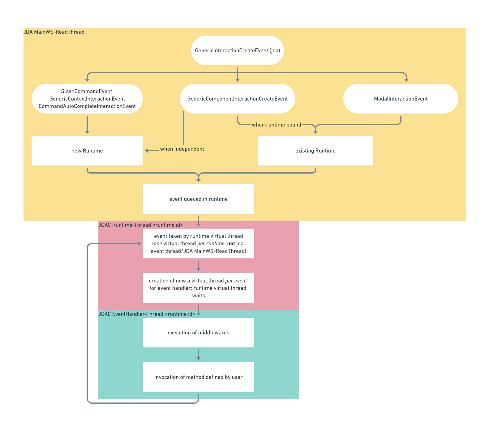

# JDA-Commands

### A declarative, annotation driven interaction framework for JDA.

---

## Resources

This is the official documentation for jda-commands. If you are new to jda-commands
(or [JDA](https://jda.wiki/introduction/jda/) in general) you might also find the following resources helpful:

- [JDA-Commands Wiki](https://github.com/Kaktushose/jda-commands/wiki)
- [Release Notes](https://github.com/Kaktushose/jda-commands/releases)
- [JDA Wiki](https://jda.wiki/)

Having trouble or found a bug?

- Check out the [Examples](https://github.com/Kaktushose/jda-commands/tree/main/src/examples)
- Join the [Discord Server](https://discord.gg/JYWezvQ)
- Or open an [Issue](https://github.com/Kaktushose/jda-commands/issues)

## How to get JDA-Commands
### Gradle
```kotlin
repositories {
   mavenCentral()
}
dependencies {
   implementation("io.github.kaktushose:jda-commands:v4.0.0-beta.4")
}
```
### Maven
```xml
<dependency>
   <groupId>io.github.kaktushose</groupId>
   <artifactId>jda-commands</artifactId>
   <version>v4.0.0-beta.4</version>
</dependency>
```

## Example usage
### 1. Create JDACommands instance and start framework
```java
public class Main {
    
    public static void main(String[] args) {
        JDA jda = yourJDABuilding();
        JDACommands jdaCommands = JDACommands.start(jda, Main.class);
    }
    
}
```

### 2. Create interaction class

```java
@Interaction
public class HelloWorld { 
    
    @SlashCommand("greet") 
    public void onCommand(CommandEvent event) {
        event.reply("Hello World!");
    }
    
}
```


## Runtime Concept

One of the core concepts in jda-commands is the so-called `Runtime`. It is mentioned frequently in the docs. A `Runtime` delegates the jda events to their corresponding `EventHandlers` and manages the used virtual threads.

A new `Runtime` is created each time a [`SlashCommandInteractionEvent`](https://javadoc.io/doc/net.dv8tion/JDA/latest/net/dv8tion/jda/api/events/interaction/command/SlashCommandInteractionEvent.html),
[`GenericContextInteractionEvent`](https://javadoc.io/doc/net.dv8tion/JDA/latest/net/dv8tion/jda/api/events/interaction/command/GenericContextInteractionEvent.html)
or [`CommandAutoCompleteInteractionEvent`](https://javadoc.io/doc/net.dv8tion/JDA/latest/net/dv8tion/jda/api/events/interaction/command/CommandAutoCompleteInteractionEvent.html) is provided by jda
or if an interaction is marked as [*independent*](io.github.kaktushose.jda.commands.core/com/github/kaktushose/jda/commands/dispatching/reply/Component.html#independent(java.lang.String...)).

Runtimes are executed in parallel, but events are processed sequentially by each runtime.
Every `EventHandler` called by this `Runtime` is executed in its own virtual thread, isolated from the runtime one.

See [`ExpirationStrategy`](io.github.kaktushose.jda.commands.core/com/github/kaktushose/jda/commands/dispatching/expiration/ExpirationStrategy.html) for
details when a `Runtime` will close.



## Project structure
The JDA-Commands project is structured in two (JPMS/gradle) modules.

|      Name       |                                                        JPMS Modules                                                        |                          Dependency                           |
|:---------------:|:--------------------------------------------------------------------------------------------------------------------------:|:-------------------------------------------------------------:|
|      core       |            [io.github.kaktushose.jda.commands.core](io.github.kaktushose.jda.commands.core/module-summary.html)            |      `io.github.kaktushose.jda-commands:core:<version>`       |
| guice-extension | [io.github.kaktushose.jda.commands.guice.extension](io.github.kaktushose.jda.commands.guice.extension/module-summary.html) | `io.github.kaktushose.jda-commands:guice-extension:<version>` |
|  jda-commands   |                                                   core + guice-extension                                                   |         `io.github.kaktushose:jda-commands:<version>`         |

### jda-commands
This is the module you get by using `io.github.kaktushose:jda-commands:<version>` as a dependency.
It contains both the `core` and `guice-extension` module and is recommended for plug and play.

Attention: If you want to write an own extension, you should strictly use the `core` module.

### core
The `core` module contains all general framework functionality, but lack a required dependency injection implementation.

### guice-extension
The `guice-extension` module implements an extension using JDA-Commands own extension system, which provides
Google's Guice as a dependency injection implementation.

For more information take a look below.

## JDACommands Guice Extension
This Extension to JDA-Commands allows the use of [Google Guice](https://github.com/google/guice)
as a dependency injection framework by providing an own implementation of
[InteractionClassInstantiator](io.github.kaktushose.jda.commands.core/com/github/kaktushose/jda/commands/dispatching/instance/InteractionClassProvider.html)

### Provide custom Injector
If you want to use a custom [Guice Injector](https://google.github.io/guice/api-docs/7.0.0/javadoc/com/google/inject/Injector.html),
you can provide one by using [`GuiceExtensionData`](io.github.kaktushose.jda.commands.guice.extension/com/github/kaktushose/jda/commands/guice/GuiceExtensionData.html).

```java
import com.github.kaktushose.jda.commands.JDACommands;
import com.github.kaktushose.jda.commands.guice.GuiceExtensionData;
import com.google.inject.Guice;

...
Injector custom = Guice.createInjector();

JDACommands jdaCommands = JDACommands.builder(jda, Main.class)
        .extensionData(new GuiceExtensionData(custom))
        .start();
...
```

### Automatically discovered implementations
This JDACommands Extension allows the automatic discovering of implementations of following interfaces:
- [Middleware](io.github.kaktushose.jda.commands.core/com/github/kaktushose/jda/commands/dispatching/middleware/Middleware.html)
- [Validator](io.github.kaktushose.jda.commands.core/com/github/kaktushose/jda/commands/dispatching/validation/Validator.html)
- [TypeAdapter](io.github.kaktushose.jda.commands.core/com/github/kaktushose/jda/commands/dispatching/adapter/TypeAdapter.html)
- [PermissionsProvider](io.github.kaktushose.jda.commands.core/com/github/kaktushose/jda/commands/permissions/PermissionsProvider.html)
- [GuildScopeProvider](io.github.kaktushose.jda.commands.core/com/github/kaktushose/jda/commands/scope/GuildScopeProvider.html)
- [ErrorMessageFactory](io.github.kaktushose.jda.commands.core/com/github/kaktushose/jda/commands/embeds/error/ErrorMessageFactory.html)
- [Descriptor](io.github.kaktushose.jda.commands.core/com/github/kaktushose/jda/commands/definitions/description/Descriptor.html)

To make these implementations discoverable please annotate the involved classes with [`@Implementation`](io.github.kaktushose.jda.commands.guice.extension/com/github/kaktushose/jda/commands/guice/Implementation.html).
If you're implementing a
[TypeAdapter](io.github.kaktushose.jda.commands.core/com/github/kaktushose/jda/commands/dispatching/adapter/TypeAdapter.html),
[Middleware](io.github.kaktushose.jda.commands.core/com/github/kaktushose/jda/commands/dispatching/middleware/Middleware.html) or
[Validator](io.github.kaktushose.jda.commands.core/com/github/kaktushose/jda/commands/dispatching/validation/Validator.html)
you have to provide additionally information in [`@Implementation`](io.github.kaktushose.jda.commands.guice.extension/com/github/kaktushose/jda/commands/guice/Implementation.html).

Please visit the docs of this class to gain more information.

#### Example

 ```java
import com.github.kaktushose.jda.commands.dispatching.middleware.Middleware;
import com.github.kaktushose.jda.commands.guice.Implementation;

@Implementation(priority = Priority.NORMAL)
public class CustomMiddleware implements Middleware {
    private static final Logger log = LoggerFactory.getLogger(FirstMiddleware.class);

    @Override
    public void accept(InvocationContext<?> context) {
        log.info("run custom middleware");
    }
}
 ```


