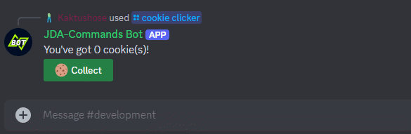

# JDA-Commands

A declarative, annotation driven interaction framework for JDA. Our goal is to remove any boilerplate code, so 
you can focus solely on the business logic of your bot - writing bots has never been easier:

=== "Code"
      ```java
      @Interaction
      public class CookieClicker {
      
          private int counter;//(1)!

          @Command(value = "cookie clicker", desc = "Play cookie clicker")
          public void onClicker(CommandEvent event) {
              event.with().components("onCookie").reply("You've got %s cookie(s)!", counter);
          }
      
          @Button(value = "Collect", emoji = "🍪", style = ButtonStyle.SUCCESS)
          public void onCookie(ComponentEvent event) {
              event.reply("You've got %s cookie(s)!", ++counter);//(2)!
          }
      }
      ```

      1. Yes, that's right! We can store the `counter` as a class variable. JDA-Commands will create a new instance of
      `CookieClicker` for every command execution, so you don't need to worry about state. You can read more about 
      it [here](./start/runtime.md).
      2. This will edit the original message and will also keep the `🍪 Collect` button attached. You can find find more 
      about building replies [here](./interactions/reply.md).

=== "Execution"
      

## Adding to your Project
=== "Maven"
      ```xml title="pom.xml"
      <dependency>
         <groupId>io.github.kaktushose</groupId>
         <artifactId>jda-commands</artifactId>
         <version>4.0.0-beta.4</version>
      </dependency>
      ```
=== "Gradle (Kotlin DSL)"
      ```kotlin title="build.gradle.kts"
      repositories {
         mavenCentral()
      }
      dependencies {
         implementation("io.github.kaktushose:jda-commands:4.0.0-beta.9")
      }
      ```
=== "Gradle (Groovy DSL)"
      ```groovy title="build.gradle"
      repositories {
         mavenCentral()
      }
      dependencies {
         implementation 'io.github.kaktushose:jda-commands:4.0.0-beta.9"'
      }
      ```

## Additional Resources

You might also find the following resources helpful:

- [Javadocs](https://kaktushose.github.io/jda-commands/javadocs/JDAC_JAVADOC_VERSION/)
- [Release Notes](https://github.com/Kaktushose/jda-commands/releases)
- [JDA Wiki](https://jda.wiki/)

Having trouble or found a bug?

- Check out the [Examples](https://github.com/Kaktushose/jda-commands/tree/main/src/examples)
- Join our [Discord Server](https://discord.gg/tmq9BrZEKb)
- Or open an [Issue](https://github.com/Kaktushose/jda-commands/issues)
