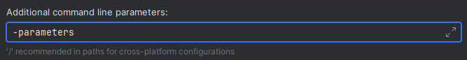

# Commands
!!! info
    If you're new to JDA and Discord Bots in general, please make yourself familiar with the
    [JDA wiki](https://jda.wiki/using-jda/interactions/) first. We assume that the basic structure of interactions is known.

## Slash Commands
SlashCommands are defined by annotating a method with <io.github.kaktushose.jdac.annotations.interactions.Command>.
The first parameter must always be a <CommandEvent>.
The name and other metadata of the command is passed to the annotation.
```java
@Command(value = "example", desc = "This is an example command")
public void onCommand(CommandEvent event) {...}
```

### Sub Commands & Sub Command Groups
In contrast to JDA, JDA-Commands doesn't differentiate between slash commands, sub command groups and sub commands.
JDA-Commands determines the type automatically based on the command names. 

Let's say we have the following commands in our moderation bot:
```java
@Command("delete")
public void onDeleteMessages(CommandEvent event) {...}

@Command("moderation warn")
public void onWarnMember(CommandEvent event) {...}

@Command("moderation kick")
public void onKickMember(CommandEvent event) {...}

@Command("moderation ban")
public void onBanMember(CommandEvent event) {...}
```
JDA-Commands will create a tree structure of these commands. A depth-first-search is then performed to determine which 
commands should be registered as a slash command, a sub command or a sub command group.
```
├── delete
└── moderation
    ├── warn
    ├── kick
    └── ban
```
??? tip "Debugging"
    JDA-Commands will log this tree on log-level `DEBUG`. This might help you with debugging, for example when command 
    doesn't show up.

In our example the following commands will be registered: 

- `/delete`
- `/moderation warn`
- `/moderation kick`
- `/moderation ban`

To simplify things, you can also use the <io.github.kaktushose.jdac.annotations.interactions.Interaction>
to add a base name to all slash commands in a command controller:
```java
@Interaction("moderation")
public class ModerationCommands {
    
    @Command("warn")
    public void onWarnMember(CommandEvent event) {...}

    @Command("kick")
    public void onKickMember(CommandEvent event) {...}

    @Command("ban")
    public void onBanMember(CommandEvent event) {...}
}
```

### Command Options
You can add command options by simply adding a parameter to the method.
```java
@Command("ban")
public void onBanMember(CommandEvent event, Member target, String reason, int delDays) {
    (...)
}
```
JDA-Commands will attempt to type adapt the command options. You can find a concrete list of all supported type adapters 
[here](../middlewares/typeadapter.md#default-type-adapters).

You can also [register your own type adapters](../middlewares/typeadapter.md).

#### OptionType
The parameters will automatically be mapped to the best fitting <OptionType>,
defaulting to <OptionType#STRING>. You can override this mapping by using the 
<io.github.kaktushose.jdac.annotations.interactions.Param> annotation. 
```java
@Command("ban")
public void onBanMember(CommandEvent event, @Param(type = OptionType.USER) IMentionable target) {
    (...)
}
```

#### Name & Description
Use the <Param> annotation to set a name and a description 
for a command option. By default, the parameter name will be used as the option name.
```java
@Command("ban")
public void onBanMember(CommandEvent event, 
                        @Param("The member to ban") Member target,
                        @Param("The reason to ban the member") String reason,
                        @Param(name = "deletion days", value = "The number of days to delete messages for") int delDays) {
    (...)
}
```
---
!!! danger inline end
    In order for JDA-Commands to use the parameter name as the command option name, you must enable the `-parameters`
    compiler flag.

=== "Maven"
    ```xml title="pom.xml"
    <plugin>
        <groupId>org.apache.maven.plugins</groupId>
        <artifactId>maven-compiler-plugin</artifactId>
        <configuration>
            <compilerArgs>
                <compilerArg>-parameters</compilerArg>
            </compilerArgs>
        </configuration>
    </plugin>
    ```

=== "Gradle (Kotlin DSL)"
    ```kotlin title="build.gradle.kts"
    tasks.withType<JavaCompile> {
        options.compilerArgs += "-parameters"
    }
    ```

=== "Gradle (Groovy DSL)" 
    ```groovy title="build.gradle"
    compileJava {
        options.compilerArgs << '-parameters'
    }
    ```

=== "IntelliJ"    
    If you compile your project with IntelliJ during development go to `Settings > Compiler > Java Compiler`
    and add the `-parameters` flag:

    
---

#### Optional
In order to make a command option optional, annotate the parameter with <Param>.
```java
@Command("ban")
public void onBanMember(CommandEvent event, Member target, @Param(optional = true) String reason, @Param(optional = true) int delDays) {
    (...)
}
```

Alternatively, you can wrap the parameter in an <Optional>.
```java
@Command("ban")
public void onBanMember(CommandEvent event, Member target, Optional<String> reason, Optional<Integer> delDays) {
    (...)
}
```

!!! note
    Required options must be added before non-required options.

#### Choices
Use the <Choices> annotation to add choices to a command option:
```java
@Command("ban")
public void onBanMember(CommandEvent event, 
                        Member target, 
                        @Choices({"Harassment", "Scam", "Advertising"}) String reason, 
                        int delDays) {
    (...)
}
```
The example above will use the given String for both the `name` and the `value`. You can use the `name:value` format to
specify both:
```java
@Command("ban")
public void onBanMember(CommandEvent event, 
                        Member target, 
                        @Choices({"Harassment:reason_1", "Scam:reason_2", "Advertising::reason_3"}) String reason, 
                        int delDays) {
    (...)
}
```

#### Auto Complete
You can add auto complete to a command option by defining an auto complete handler for it by annotating a method with
AutoComplete>. Auto Complete handlers are always bound to 
one or more slash commands. 

The slash commands can either be referenced by the:

1. Command Name

    If referenced by the command name, the handler will handle any command whose name starts with the given name:
    !!! example
        ```java
        @Command("favourite fruit")
            public void fruitCommand(CommandEvent event, String fruit) {
            event.reply("You've chosen: %s", fruit);
        }

        @Command("favourite vegetable")
        public void vegetableCommand(CommandEvent event, String vegetable) {
            event.reply("You've chosen: %s", vegetable);
        }

        @AutoComplete("favourite") //(1)!
        public void onFavouriteAutoComplete(AutoCompleteEvent event) {
            event.replyChoices(...);
        }
        ```

        1. This auto complete handler will receive auto complete events for both `/favourite fruit` and `/favourite vegetable`

    It is also possible to reference the commands by their full name:
    !!! example
        ```java
        @AutoComplete({"favourite fruit", "favourite vegtable"})
        public void onFavouriteAutoComplete(AutoCompleteEvent event) {
            event.replyChoices(...);
        }
        ```

2. Method Name

    If referenced by the method name the handler will only handle the slash command of the given method:

    !!! example
        ```java
        @Command("favourite fruit")
        public void fruitCommand(CommandEvent event, String fruit) {
            event.reply("You've chosen: %s", fruit);
        }

        @AutoComplete("fruitCommand") //(1)!
        public void onFruitAutoComplete(AutoCompleteEvent event) {
            event.replyChoices(...);
        }    
        ```
        
        1. This auto complete handler will **only** receive auto complete events for `/favourite fruit`!

!!! warning
    If an auto complete handler doesn't specify any command options, it will be registered implicitly for every command
    option of the given slash command(s)!

So far we haven't specified which command options should have auto complete, resulting in every command option having 
auto complete enabled. If you want to avoid that, you have to explicitly state the command options the handler supports:

!!! example
    ```java
    @Command("favourite food")
    public void foodCommand(CommandEvent event, String fruit, String vegetable) {
        event.reply("You've chosen: %s and %s", fruit, vegetable);
    }
    
    @AutoComplete(vale = "foodCommand", options = "fruit")
    public void onFruitAutoComplete(AutoCompleteEvent event) {
        event.replyChoices(...);
    }
    ```

You can have multiple auto complete handler for the same slash command, but each command option can only have exactly 
one handler. An auto complete handler that explicitly supports a command option will always be called over a handler 
that is implicitly registered.

#### Min & Max Value
Use the <Min> or <Max>
annotation to set the minimum and maximum value for numeral options. 
!!! example
    ```java
    @Command("ban")
    public void onBanMember(CommandEvent event, Member target, String reason, @Max(7) int delDays) {
        (...)
    }
    ```

## Context Commands
Both types of context commands are defined by the same <io.github.kaktushose.jdac.annotations.interactions.Command>
annotation. The first parameter must always be a <CommandEvent>.
The name and other metadata of the command is passed to the annotation.

### Message Context
For message context commands the second method parameter must be a <Message>
and the `type` must be <net.dv8tion.jda.api.interactions.commands.Command.Type#MESSAGE>.
```java
@Command(value = "Delete this message", type = Command.Type.MESSAGE)
public void onDeleteMessage(CommandEvent event, Message target) { ... }
```

### User Context
For user context commands the second method parameter must be a <User>
and the `type` must be <Command.Type#USER>.
```java
@Command(value = "Ban this user", type = Command.Type.USER)
public void onBanMember(CommandEvent event, User user) { ... }
```

Alternatively, you can also use <net.dv8tion.jda.api.entities.Member> in the method signature. However, this only works for 
<InteractionContextType#GUILD>.

```java
@Command(value = "Ban this user", type = Command.Type.USER)
@CommandConfig(context = InteractionContextType.GUILD) // default value
public void onBanMember(CommandEvent event, Member member) { ... }
```

## Additional Settings
Use the <io.github.kaktushose.jdac.annotations.interactions.CommandConfig> annotation to configure the 
following settings. You can either annotate a command method directly or annotate the interaction controller class. It 
is also possible to set a [global command config][[JDACBuilder#globalCommandConfig(CommandDefinition.CommandConfig)]]
at the builder:

!!! example "Global CommandConfig"
    ```java
    JDACommands.builder(jda, Main.class)
        .globalCommandConfig(CommandConfig.of(config -> config.nsfw(true))
        .start();
    ```

JDA-Commands will apply clashing CommandConfigs in the following hierarchy:

1. `CommandConfig` method annotation
2. `CommandConfig` class annotation
3. global `CommandConfig`

### enabledFor
Sets the [`Discord Permissions`][[net.dv8tion.jda.api.Permission]] a command will be enabled for. By default, a command 
will be enabled for every permission.
!!! danger
    Guild admins can modify these permissions at any time! If you want to enforce permissions or secure a critical command
    further you should use the permissions system of JDA-Commands. You can read more about it [here](../middlewares/permissions.md).

```java
@CommandConfig(enabledFor = Permission.BAN_MEMBERS)
@Command(value = "example")
public void onCommand(CommandEvent event) {...}
```

### context
Sets the [InteractionContextTypes][[InteractionContextType]]
of a command. The default value is <InteractionContextType#GUILD>.

```java
@CommandConfig(context = {InteractionContextType.GUILD, InteractionContextType.BOT_DM})
@Command(value = "example")
public void onCommand(CommandEvent event) {...}
```

### integration
Sets the [IntegrationTypes][[IntegrationType]]
of a command. The default value is <IntegrationType#GUILD_INSTALL>.

```java
@CommandConfig(integration = {IntegrationType.GUILD_INSTALL, IntegrationType.USER_INSTALL})
@Command(value = "example")
public void onCommand(CommandEvent event) {...}
```

### isNSFW
Sets whether a command can only be executed in NSFW channels. The default value is `false`.

```java
@CommandConfig(isNSFW = true)
@Command(value = "example")
public void onCommand(CommandEvent event) {...}
```

### scope (Guild & Global Commands)
Sets whether a command should be registered as a `global` or as a `guild` command. The default value is `global`.

```java
@CommandConfig(scope = CommandScope.GUILD)
@Command(value = "example")
public void onCommand(CommandEvent event) {...}
```

When having guild scoped commands you have to use the <GuildScopeProvider> to 
tell JDA-Commands what guilds a command should be registered for. 

Let's say we have a paid feature in our bot:
!!! example
    ```java
    @CommandConfig(scope = CommandScope.GUILD)
    @Command(value = "paid feature")
    public void onCommand(CommandEvent event) {
        event.reply("Hello World!");
    }
    ```

We then need to implement a <GuildScopeProvider> to only register this command
for guilds that have paid for that feature:
!!! example
    ```java
    public class PremiumGuildsProvider implements GuildScopeProvider {

        @Override
        public Set<Long> apply(CommandData commandData) {
            if (commandData.getName().equals("paid feature")) {
                // this is the place where you could also perform a database lookup
                return Set.of(1234567890L);
            }
            return Set.of();
        }
    }
    ```

Finally, we have to register our `PremiumGuildsProvider`. We can either pass it to the builder:
!!! example
    ```java
    JDACommands.builder(jda, Main.class)
        .guildScopeProvider(new PremiumGuildsProvider())
        .start();
    ```

or simply annotate the `PremiumGuildsProvider` class with <io.github.kaktushose.jdac.guice.Implementation>.
!!! note
    Using the <io.github.kaktushose.jdac.guice.Implementation> annotation requires the guice integration 
    (shipped by default). You can read more about it [here](../di.md).   