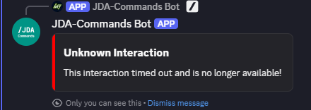

# Reply Building
!!! note
    All event types share the same Reply API. JDA-Commands will only acknowledge the interaction event just before sending the reply. If you need more time, e.g. for doing a database query, you can always manually acknowledge events by calling [`event#deferReply()`][[ReplyableEvent#deferReply()]].

## Localization and Placeholders
To avoid hardcoded values, all string properties of a component/the content of a message can be replaced by a localization key as supported by the
current used [Localization System](../message/localization.md).

Furthermore, it's possible to directly use placeholders.
For more information on how to use placeholders please visit [this page](../message/placeholder.md).

Also take a look at the general [message resolution documentation](../message/overview.md).

!!! example
    ```java
    event.with().ephemeral(true).reply("my.localizatoin.key");
    ```

## Unicode and application emojis
JDA-Commands has built in support for Unicode and application emoji aliases.
If you want to use them, just take a look [here](../message/emojis.md).

## Text Messages
The simplest way of sending a reply is using the <ReplyableEvent#reply(java.lang.String, Entry...)>
method. This will send a non-ephemeral text message. If the event has already been replied to, this method will edit the 
original message instead of sending a new one by default.

The `reply()` method also has some useful overloads, you can find a full list [here](https://kaktushose.github.io/jda-commands/javadocs/JDAC_JAVADOC_VERSION/io.github.kaktushose.jda.commands.core/com/github/kaktushose/jda/commands/dispatching/reply/Reply.html#method-detail).

## Reply Configuration
You can change the default reply behavior by calling <ReplyableEvent#with()>
before sending the reply. This will return a <ConfigurableReply>
object to you, you can use to modify settings:

!!! example "Ephemeral Reply"
    ```java
    event.with().ephemeral(true).reply("Hello World!");
    ```

When calling <ComponentEvent#with()> you get a <EditableConfigurableReply> which allows for even more settings:

- [`editReply(boolean)`][[EditableConfigurableReply#editReply(boolean)]]: This will send a new message instead of editing the original one.
- [`keepComponents(boolean)`](#keeping-components): This will keep the original components
- [`keepSelections(boolean)`](#keeping-selections): This will keep the user selections of the original components

## Action Components
### Replying with Action Components
The <ConfigurableReply>
object is also used to attach components. You reference action components by the name of the method they are defined with, just
like we did before with [modals](./modals.md#replying-with-modals).

!!! example
    ```java
    @Command("greet")
    public void onCommand(CommandEvent event) {
        event.with().components("onButton").reply("Hello World!"); //(1)!
    }

    @Button("Greet me!")
    public void onButton(ButtonEvent event) { 
        event.reply("Hello %s".formatted(event.getUser().getAsMention()));
    }
    ```

    1. We reference the Button we want to send via the method name.

You can also omit the text message and only send the component by calling `reply()` with no arguments.

!!! tip
    JDA-Commands allows reusing a component multiple times in one reply message.
    To learn more about how this works, consult the javadocs of <CustomId>.

### Action Rows
Every call to `components()` will create a new action row. If you want more than one action row you need to call
`components()` multiple times.

!!! example
    ```java
    event.with().components("firstButton").components("secondButton").reply();
    ```

If you want to add multiple action components to the same action row, just pass the method names to the same `components()` call.

!!! example
    ```java
    event.with().components("firstButton", "secondButton").reply();
    ```

!!! note 
    One action row supports up to 5 buttons but only 1 select menu.

### Enabling & Disabling
By default, all action components are enabled. If you want to attach a disabled action component, you need to wrap it by calling
<Component#disabled(java.lang.String, Entry...)>


If you want to add multiple action components to the same action row, with some of them enabled and some disabled, you need to
wrap all of them.

!!! example
    ```java
    event.with.components(Component.disabled("firstButton"), Component.enabled("secondButton")).reply();
    ```

### Keeping Components
When working with components and especially when building menus, e.g. a pagination with buttons, it is often needed to
keep the components attached, even when editing the original message multiple times. 

Normally, Discord would remove any components when sending a message edit, unless they are explicitly reattached.

JDA-Commands flips this behavior and will keep your components attached by default. 

You can disable this by calling [`keepComponents(false)`][[EditableConfigurableReply#keepComponents(boolean)]]:
!!! example
    ```java
    event.with().keepComponents(false).reply("Message edit!");
    ```

Alternatively you can call <ComponentEvent#removeComponents()> which will remove all action components attached to a message.

!!! note
    When using Components V2 calling <ComponentEvent#removeComponents()> will throw an <UnsupportedOperationException> because this would result
    in an empty message.

---
!!! example "Cookie Clicker Example"
    === "Code"
        ```java
        @Interaction
        public class CookieClicker {
        
            private int counter;
            
            @Command(value = "cookie clicker", desc = "Play cookie clicker")
            public void onClicker(CommandEvent event) {
                event.with().components("onCookie").reply("You've got { $count } cookie(s)!", entry("count", counter));
            }
            
            @Button(value = "Collect", emoji = "🍪", style = ButtonStyle.SUCCESS)
            public void onCookie(ComponentEvent event) {
                event.reply("You've got { $count } cookie(s)!", entry("count", counter++));
            }
        }
        ```
          
    === "Execution"
        

### Keeping Selections
By default, JDA-Commands will also retain the selections of select menus when sending a reply with `keepComponents` set
to `true`. You can disable this by calling [`keepSelections(false)`][[EditableConfigurableReply#keepSelections(boolean)]]:
    !!! example
    ```java
    event.with().keepSelections(false).reply("Message edit!");
    ```

### Foreign Components
You can attach action components that were defined in a different class by using the <Component#enabled(java.lang.Class,java.lang.String, Entry...)>
class again. In addition to the method name, you must also pass the class reference in that case.

!!! example
    ```java
    event.with()
        .components(Component.enabled(ButtonHelpers.class, "onConfirm"), Component.enabled(ButtonHelpers.class, "onDeny"))
        .reply("Are you sure?");
    ```

The foreign action component will use the original [Runtime](../start/runtime.md) just like any other action component would. If no 
instance of the class the action component is defined in (_`ButtonHelpers` in the example above_) exists yet, 
the [Runtime](../start/runtime.md) will create one instance (and store it for potential future method calls). 

### Lifetime
As discussed [earlier](../start/runtime.md#lifetime), Runtimes have a limited lifetime. By default, JDA-Commands will close
a Runtime after 15 minutes of no activity have passed. 

!!! danger "Component Lifetime"
    This means all action components belonging to that Runtime will stop working once the Runtime is closed!

JDA-Commands will handle this case for you. This error message can be [customized](../misc/error-handling.md#error-messages).



If you want to avoid this behavior, you have to reply with action components that are `runtime-independent`. They will create a
new `Runtime` everytime they are executed. These action components will even work after a full bot restart! If you want them to not be usable anymore you need to remove
them on your own.

!!! info inline end
    Modals cannot be independent because they always need a parent interaction that triggers them!

!!! example
    ```java
    event.with().components(Component.independent("onButton")).reply("Hello World!");
    ```

### Dynamic Components
Just like with Modals, you can dynamically modify components too. Use the <Component#enabled(java.lang.Class,java.lang.String,Entry...)>
class to access a builder object, which wraps the JDA builder. Alternatively, you can access the native JDA builder by
calling `#modify`.

!!! example
    ```java
    event.with().components(Component.button("onButton").label("New Label")).reply("Hello World!");

    event.with().components(Component.stringMenu("onMenu").modify(jdaBuilder -> ...).reply("Hello World!");
    ```

## Components V2
!!! note
    This section assumes that you are already familiar with Components V2. You can find the Discord documentation [here](https://discord.com/developers/docs/change-log/2025-04-22-components-v2).
    Also, please have a look at JDAs component [classes](https://docs.jda.wiki/net/dv8tion/jda/api/components/package-summary.html).

### Replying with Components V2

You can reply with Components V2 by passing one or more <MessageTopLevelComponent>s to the 
[`reply()`][[ReplyableEvent#reply(Collection<MessageTopLevelComponent>, Entry...)]] method. 
This will automatically enable the V2 flag. Note that this method is only available either directly at the event class or at the <ConfigurableReply>
stage (accessed by calling [`with()`][[ReplyableEvent#with()]]). 
!!! example
    ```java
    event.reply(TextDisplay.of("Hello World"));

    event.with().ephemeral(true).reply(TextDisplay.of("Hello World"));
    ```
Note, that you cannot reply with Components V2 after:

- `components(...)`
- `embeds(...)`
- `builder(...)`

has been called, because adding content, embeds, files, etc. disqualifies the message from being Components V2.

### Action Components
Components V2 also can have action components. They can either be added to an <ActionRow> or a <SectionAccessoryComponent> 
as part of a <net.dv8tion.jda.api.components.section.Section>. You add them by using the 
<io.github.kaktushose.jdac.dispatching.reply.Component> class.

!!! example
    ```java
    event.reply(Section.of(Component.button("onButton"), TextDisplay.of("Useless Button")));

    event.reply(ActionRow.of(Component.stringSelect("onMenu"))));
    ```

[Enabling and disabling](#enabling-disabling) as well as [modifying](#dynamic-components) works the same 
as explained before.

### Subsequent Replies
Once you've sent a Components V2 message it has to remain Components V2. The [Reply Configuration](#reply-configuration) rules
also apply to Components V2. 

Often, you want to keep the original components, but edit some of them. You can do so by calling 
[`reply(ComponentReplacer... replacer)`][[ComponentEvent#reply(ComponentReplacer, Entry...)]].
This method will enforce `keepComponents` and throw an <UnsupportedOperationException> if the message isn't Components V2.

!!! example
    ```java
    public void onComponent(ComponentEvent event) {
        event.reply(ComponentReplacer.byUniqueId(1, TextDisplay.of("Updated Component")));
    }
    ```

To make working with the <ComponentReplacer> easier, you can assign unique ids to components. For action components, which
are defined by JDA-Commands, you can either use the component annotation (e.g. `@Button`) or the [dynamic components API](#dynamic-components).

## Embeds
JDA-Commands provides a rich Embed API to make working with Embeds easier. See the [Embed Section](../message/embeds.md) of this wiki for
setup instructions. Once you have your <EmbedDataSource>
configured you can start using Embeds in your replies. 

Use the <ConfigurableReply> object, which is accessed by calling 
<ReplyableEvent#with()>, 
to attach Embeds to your reply. The easiest way of replying with an Embed is to simply pass the Embeds name:
!!! example
    ```java
    event.with().embeds("welcome").reply();
    ```
You can also pass multiple names or call the `#embed(...)` method multiple times:
!!! example
    ```java
    event.with().embeds("welcome", "goodbye").reply();
    
    event.with().embeds("welcome").embeds("goodbye").reply();
    ```
For modifying you can either use the <Embed> object or use a callback:
!!! example
    === "Embed Object"
        ```java
        Embed embed = event.embed("welcome");
        embed.title("New title");
        event.with().embeds(embed).reply();
        ```
    === "Callback"
        ```java
        event.with().embeds("welcome", embed -> embed.title("New title")).reply();
        ```

Placeholders can be passed not only to the <Embed>
object, but also directly to the `#embed(...)` method:
!!! example
    ```java
    event.with().embeds("welcome", Entry.entry("user", "Kaktushose")).reply();
    ```

## ReplyConfig
The <io.github.kaktushose.jdac.annotations.interactions.ReplyConfig>
annotation provides a way to modify the default behaviour for the `editReply`, `ephemeral` and `keepComponents` settings. 
You can either annotate single methods or entire interaction controllers. 

!!! example "ReplyConfig Annotation"
    ```java
    @Interaction
    @ReplyConfig(ephemeral = true)
    public class InteractionController {
        
        @Command("example")
        @ReplyConfig(editReply = false)
        public void onCommand(CommandEvent) {...}
        
    }
    ```

Alternatively, you can set a [global reply config][[JDACBuilder#globalReplyConfig(InteractionDefinition.ReplyConfig)]]
at the builder:

!!! example "Global ReplyConfig"
    ```java
    JDACommands.builder(jda, Main.class)
        .globalReplyConfig(new ReplyConfig(true, false, false))
        .start();
    ```

JDA-Commands will apply clashing ReplyConfigs in the following hierarchy:

1. `with()#...` calls 
2. `ReplyConfig` method annotation
3. `ReplyConfig` class annotation
4. global `ReplyConfig`
