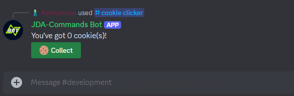
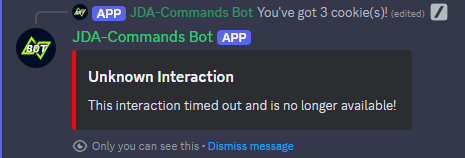

# Replying with Action Components
The <ConfigurableReply>
object is also used to attach components. You reference action components by the name of the method they are defined with, just
like we did before with [modals](.././modals.md#replying-with-modals).

!!! example
    ```java
    @Command("greet")
    public void onCommand(CommandEvent event) {
        event.with().components("onButton").reply("Hello World!"); //(1)!
    }
    
    @Button("Greet me!")
    public void onButton(ButtonEvent event) {
        event.reply("Hello %s".formatted(event.getUser().getAsMention()));
    }
    ```
    
    1. We reference the Button we want to send via the method name.

You can also omit the text message and only send the component by calling `reply()` with no arguments.

## Action Rows
Every call to `components()` will create a new action row. If you want more than one action row you need to call
`components()` multiple times.

!!! example
    ```java
    event.with().components("firstButton").components("secondButton").reply();
    ```

If you want to add multiple action components to the same action row, just pass the method names to the same `components()` call.

!!! example
    ```java
    event.with().components("firstButton", "secondButton").reply();
    ```

!!! note
    One action row supports up to 5 buttons but only 1 select menu.

## Enabling & Disabling
By default, all action components are enabled. If you want to attach a disabled action component, you need to wrap it by calling
<Component#disabled(java.lang.String, Entry...)>


If you want to add multiple action components to the same action row, with some of them enabled and some disabled, you need to
wrap all of them.

!!! example
    ```java
    event.with.components(Component.disabled("firstButton"), Component.enabled("secondButton")).reply();
    ```

## Keeping Components
When working with components and especially when building menus, e.g. a pagination with buttons, it is often needed to
keep the components attached, even when editing the original message multiple times.

Normally, Discord would remove any components when sending a message edit, unless they are explicitly reattached.

JDA-Commands flips this behavior and will keep your components attached by default.

You can disable this by calling [`keepComponents(false)`][[EditableConfigurableReply#keepComponents(boolean)]]:
!!! example
    ```java
    event.with().keepComponents(false).reply("Message edit!");
    ```

Alternatively you can call <ComponentEvent#removeComponents()> which will remove all action components attached to a message.

!!! note
    When using Components V2 calling <ComponentEvent#removeComponents()> will throw an <UnsupportedOperationException> because this would result
    in an empty message.

---
!!! example "Cookie Clicker Example"
    === "Code"
        ```java
        @Interaction
        public class CookieClicker {

            private int counter;
            
            @Command(value = "cookie clicker", desc = "Play cookie clicker")
            public void onClicker(CommandEvent event) {
                event.with().components("onCookie").reply("You've got { $count } cookie(s)!", entry("count", counter));
            }
            
            @Button(value = "Collect", emoji = "🍪", style = ButtonStyle.SUCCESS)
            public void onCookie(ComponentEvent event) {
                event.reply("You've got { $count } cookie(s)!", entry("count", counter++));
            }
        }
        ```
          
    === "Execution"
        

## Keeping Selections
By default, JDA-Commands will also retain the selections of select menus when sending a reply with `keepComponents` set
to `true`. You can disable this by calling [`keepSelections(false)`][[EditableConfigurableReply#keepSelections(boolean)]]:
!!! example
    ```java
    event.with().keepSelections(false).reply("Message edit!");
    ```

## Foreign Components
You can attach action components that were defined in a different class by using the <Component#enabled(java.lang.Class,java.lang.String, Entry...)>
class again. In addition to the method name, you must also pass the class reference in that case.

!!! example
    ```java
    event.with()
        .components(Component.enabled(ButtonHelpers.class, "onConfirm"), Component.enabled(ButtonHelpers.class, "onDeny"))
        .reply("Are you sure?");
    ```

The foreign action component will use the original [Runtime](../../start/runtime.md) just like any other action component would. If no
instance of the class the action component is defined in (_`ButtonHelpers` in the example above_) exists yet,
the [Runtime](../../start/runtime.md) will create one instance (and store it for potential future method calls).

## Lifetime
As discussed [earlier](../../start/runtime.md#lifetime), Runtimes have a limited lifetime. By default, JDA-Commands will close
a Runtime after 15 minutes of no activity have passed.

!!! danger "Component Lifetime"
    This means all action components belonging to that Runtime will stop working once the Runtime is closed!

JDA-Commands will handle this case for you. This error message can be [customized](../../misc/error-handling.md#error-messages).



If you want to avoid this behavior, you have to reply with action components that are `runtime-independent`. They will create a
new `Runtime` everytime they are executed. These action components will even work after a full bot restart! If you want them to not be usable anymore you need to remove
them on your own.

!!! info inline end
    Modals cannot be independent because they always need a parent interaction that triggers them!

!!! example
    ```java
    event.with().components(Component.independent("onButton")).reply("Hello World!");
    ```

## Dynamic Components
Just like with Modals, you can dynamically modify components too. Use the <Component#enabled(java.lang.Class,java.lang.String,Entry...)>
class to access a builder object, which wraps the JDA builder. Alternatively, you can access the native JDA builder by
calling `#modify`.

!!! example
    ```java
    event.with().components(Component.button("onButton").label("New Label")).reply("Hello World!");

    event.with().components(Component.stringMenu("onMenu").modify(jdaBuilder -> ...).reply("Hello World!");
    ```
