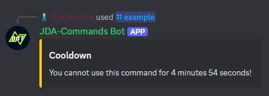

# Slash Command Cooldown
!!! bug inline end "Note"
    The cooldown API is an old and rarely used feature. Thus, revisiting it isn't a top priority in JDA-Commands development. 
    If you want it to be improved, feel free to [open an issue](https://github.com/Kaktushose/jda-commands/issues/new).

Slash commands can have a cooldown to limit their usage. The cooldown is applied _globally_, _per user_, _per command_. 
You can add a cooldown by annotating a slash command method with [`@Cooldown`](https://kaktushose.github.io/jda-commands/javadocs/4/io.github.kaktushose.jda.commands.core/com/github/kaktushose/jda/commands/annotations/interactions/Cooldown.html).

!!! example
    ```java
    @Cooldown(value = 5, timeUnit = TimeUnit.MINUTES)
    @Command("example")
    public void onCommand(CommandEvent event) {
        ...
    }
    ```

If a command still has a cooldown, an error message gets sent to the user.



_You can customize this error message, find more about it [here](../misc/error-handling.md#error-messages)._
