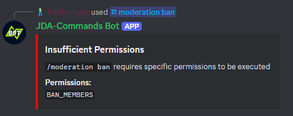

# Permissions
When it comes to permissions there are essentially two options:

1. Use the [`default permissions`](../interactions/commands.md#enabledfor) of a slash command. This defines a set of 
permissions of who can use a command by default. This will perform a Discord client side check. 

2. Use the permissions system of JDA-Commands described below. This will perform a bot side permissions check guild admins
have no influence on.

!!! danger
    Guild admins can modify the `default permissions` of a slash command at any time!  If you want to enforce permissions 
    or secure a critical command further you should use the permissions system of JDA-Commands.

## Adding Permissions to an Interaction
Use the <io.github.kaktushose.jdac.annotations.interactions.Permissions>
annotation to add permissions to an interaction. This isn't limited to slash commands, but can
be any type of interaction. 

The <io.github.kaktushose.jdac.annotations.interactions.Permissions>
annotation takes an arbitrary amount of Strings as input. Each String defines a `permission` that must be present. By default,
you can pass Discord Permissions, like `BAN_MEMBERS`. JDA-Commands will then check if the executor has the respective
Discord Permission before executing the interaction. 

!!! example
    ```java
    @Permissions("BAN_MEMBERS")
    @Command("moderation ban")
    public void onBan(CommandEvent event, Member target) {...}
    ```

Instead of annotating individual interaction methods, you can also annotate the interaction controller class. Class 
annotation permissions and method annotation permissions will be combined. 
!!! example
    ```java
    @Permissions("ADMINISTRATOR")
    public class AdminCommands {...}
    ```

## Error Message
If a user is lacking permissions, JDA-Commands will send an error message:



You can customize this error message, find more about it [here](../misc/error-handling.md#error-messages).


## Own Permissions
You can also set up your own permission system, which goes beyond the usage of Discord Permissions. Since you only pass
Strings, you have a lot of freedom in the design. Common design choices are:

- Domain based system, e.g. `guild.mod.kick`, `guild.mod.ban`, etc. also allowing for wildcards like `guild.mod.*`
- Role based system, e.g. having a `USER`, `MODERATOR`, `ADMIN`, etc. role

For our example, let's go with a role based system:

!!! example
    ```java
    @Permissions({"MODERATOR", "ADMIN"})
    @Command("moderation ban")
    public void onBan(CommandEvent event, Member target) {...}
    ```

The default <PermissionsProvider>
implementation will always fail, because both `MODERATOR` and `ADMIN` are invalid, we have to provide our own implementation. 

### PermissionsProvider Implementation
The <PermissionsProvider>
has two almost identical [`hasPermissions(...)`](https://kaktushose.github.io/jda-commands/javadocs/JDAC_JAVADOC_VERSION/io.github.kaktushose.jda.commands.core/com/github/kaktushose/jda/commands/permissions/PermissionsProvider.html#method-detail) methods.

The first one gives you an `User` object, the second one a 
`Member` object. Therefore, the first method is for interactions that are not executed on a guild (e.g. DMs) and the 
second method is for interactions that take place on a guild. Both methods also give you access to the 
<InvocationContext>.

This distinction does not necessarily have to be relevant. In most cases, the _member method_ can simply call the _user method_.

??? question inline end "What's the difference between a Member and a User?"
    Discord differentiates between `Users` and `Members`, whereby a `User` represents a global Discord user, and a 
    `Member` represents a Discord user on a specific guild.

!!! example
    ```java
    public class RolePermissionsProvider implements PermissionsProvider {

        private final Collection<Long> admins = List.of(1234567890L);
        private final Collection<Long> moderators = List.of(1234567890L, 987654321L); //(1)!

        @Override
        public boolean hasPermission(User user, InvocationContext<?> context) {
            boolean hasPermissions = true; //(2)!

            for (String permission : context.definition().permissions()) {
                switch (permission) {
                    case "ADMIN" -> hasPermissions = admins.contains(user.getIdLong());
                    case "MODERATOR" -> hasPermissions = moderators.contains(user.getIdLong());
                    default -> System.out.println("Unknown permission: " + permission);
                }
            }
        
            return hasPermissions;
        }

        public boolean hasPermission(@NotNull User user, InvocationContext<?> context) {
            return hasPermission(member.getUser());
        }
    }
    ```
    
    1. This is a very basic example. In a real world application, you should best use a database for this.
    2. This has to be `true`, so that interactions which don't have any permissions defined, don't fail. 

Lastly, we have to register our `RolePermissionsProvider`.

!!! example
    === "`@Implementation` Registration"
        ```java
        @Implementation
        public class RolePermissionsProvider implements PermissionsProvider {
            ...
        }
        ```

    === "Builder Registration" 
        ```java
        JDACommands.builder(jda, Main.class)
            .permissionsProvider(new RolePermissionsProvider());
            .start();
        ```
