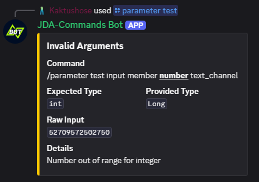

# Type Adapters
[TypeAdapters][[com.github.kaktushose.jda.commands.dispatching.adapter.TypeAdapter]]
are a part of the execution chain. They are used to adapt the input of a slash command to the correct type needed to invoke the method.

## Default Type Adapters
JDA-Commands uses [Proteus](https://github.com/Kaktushose/proteus) for its type adapting system. Proteus supports all
widening and narrowing primitive conversions as defined by the Java Language Specification. Additionally, JDA-Commands
has implemented default type adapters for JDAs <GuildChannel>
and its subtypes.

Thus, you can add all primitive types and their respective wrapper types as well as any underlying type of the 
<OptionType> enum
as a parameter to your slash command methods. See [Command Options](../interactions/commands.md#command-options)
for details.

## Writing Own Type Adapters
As mentioned above, JDA-Commands uses [Proteus](https://github.com/Kaktushose/proteus) under the hood for type adapting.
The <com.github.kaktushose.jda.commands.dispatching.adapter.TypeAdapter> interface is simply a subtype of Proteus' <proteus -> UniMapper>
The following example only covers the registration part for JDA-Commands. Please refer to the [`documentation`](https://kaktushose.github.io/proteus/wiki/)
of Proteus for implementation details. 

!!! example
    === "Command"
        ```java
        @Command("example")
        public void onCommand(CommandEvent event, UserProfile profile) {
            ...
        }
        ```

    === "Type Adapter (`@Implementation` Registration)"
        ```java
        @Implementation.TypeAdapter(source = String.class, target = UserProfile.class)
        public class UserProfileTypeAdapter implements TypeAdapter<String, UserProfile> {
            
            public MappingResult<UserProfile> from(String source, MappingContext<String, UserProfile> context) {
                return MappingResult.lossless(new UserProfile(source));
            }

        }
        ```

    === "Type Adapter (Builder Registration)"
        ```java
        public class UserProfileTypeAdapter implements TypeAdapter<String, UserProfile> {
            
            public MappingResult<CustomType> from(String source, MappingContext<String, UserProfile> context) {
                return MappingResult.lossless(new UserProfile(source));
            }

        }
        ```
        ```java
        JDACommands.builder(jda, Main.class)
            .adapter(String.class, UserProfile.class, new UserProfileTypeAdapter());
            .start();
        ```

!!! tip
    If your type adapter is simple enough, you could also just use lambda expressions: 
    ```java
    JDACommands.builder(jda, Main.class)
        .adapter(String.class, UserProfile.class, (source, _) -> MappingResult.lossless(new UserProfile(source)));
        .start();
    ```


Your own types will be mapped to `OptionType.STRING` by default. You can
override this mapping by using the <Param>
annotation.
!!! example
    ```java
    @Command("example")
    public void onCommand(CommandEvent event, @Param(type = OptionType.USER) UserProfile profile) {
        ...
    }
    ```
For our example this would also mean that we would need to update the `UserProfileTypeAdapter` to use `User` instead of
`String` as its source type. 

## Error Messages

If the type adapting fails an error message will be sent to the user:



_You can customize this error message, find more about it [here](../misc/error-handling.md#error-messages)._
