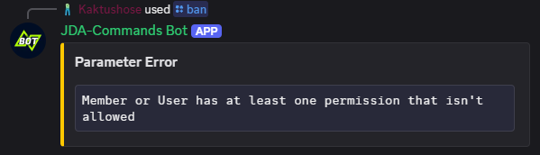

# Validators
Command Options of a Slash Command can have constraints. You can add constraints by annotating the method parameter
with the respective annotation. 

## Default Validators
JDA-Commands comes with the following default constraints:

- [`@Perm`](https://kaktushose.github.io/jda-commands/javadocs/4/io.github.kaktushose.jda.commands.core/com/github/kaktushose/jda/commands/annotations/constraints/Perm.html):
  The user or member that have the specified discord permission.
- [`@NotPerm`](https://kaktushose.github.io/jda-commands/javadocs/4/io.github.kaktushose.jda.commands.core/com/github/kaktushose/jda/commands/annotations/constraints/NotPerm.html):
  The user or member that **doesn't** have the specified discord permission.

!!! example
    ```java
    @Command("ban")
    public void onBan(CommandEvent event, @NotPerm("ADMINISTRATOR") Member target) {...}
    ```

An error message is sent, if a parameter constraint fails:



_You can customize this error message, find more about it [here](../misc/error-handling.md#error-messages)._

The fail messages of these two default constraints be [localized](../localization.md) with the localization keys 
`validator.noperm.fail` or `validator.perm.fail` respectively. 

## Writing own Validators

### 1. Creating the Annotation
First, you need to create an annotation type for your validator. Your annotation must meet the following conditions:

- [x] `@Target` must be `ElementType.PARAMETER`
- [x] `RetentionPolicy` must be `RUNTIME`
- [x] Must be annotated with [`@Constraint`](https://kaktushose.github.io/jda-commands/javadocs/4/io.github.kaktushose.jda.commands.core/com/github/kaktushose/jda/commands/annotations/constraints/Constraint.html)
defining the valid types for this annotation. 

!!! example
    ```java
    @Target(ElementType.PARAMETER)
    @Retention(RetentionPolicy.RUNTIME)
    @Constraint(String.class)
    public @interface MaxString {
        int value();
    }
    ```

### 2. Creating the Validator
Secondly, you must create the actual validator by implementing the [`Validator`](https://kaktushose.github.io/jda-commands/javadocs/4/io.github.kaktushose.jda.commands.core/com/github/kaktushose/jda/commands/dispatching/validation/Validator.html)
interface. 

The `apply(...)` method will give you the argument (command option) as well as the annotation object. 
If the constraint should fail, you must call [`context.fail(...)`](https://kaktushose.github.io/jda-commands/javadocs/4/io.github.kaktushose.jda.commands.core/com/github/kaktushose/jda/commands/dispatching/validation/Validator.Context.html#fail(java.lang.String,com.github.kaktushose.jda.commands.i18n.I18n.Entry...)). 

!!! example
    ```java
    public class MaxStringLengthValidator implements Validator<String, MaxString> {
        
        public boolean apply(String argument, MaxString annotation, Context context) {
            if (argument.length() < maxString.value()) {
                context.fail("The given String is too long");
            }
        }
    }
    ```

### 3. Registration
Lastly, you have to register your new validator.

!!! example
    === "Builder Registration"
        ```java
        JDACommands.builder(jda, Main.class)
            .validator(MaxString.class, new MaxStringLengthValidator());
            .start();
        ```
    === "`@Implementation` Registration"
        ```java
        @Implementation.Validator(annotation = MaxString.class)
        public class MaxStringLengthValidator implements Validator {
            ...
        }
        ```
