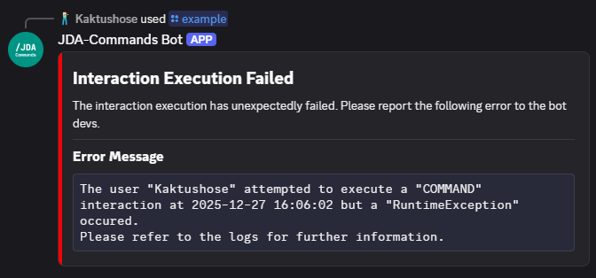

# Error Handling

## Exceptions
JDA-Commands defines a set of custom runtime exceptions that can occur:
 
- <io.github.kaktushose.jdac.exceptions.ConfigurationException> will be thrown if anything goes wrong while configuring JDA-Commands
- <io.github.kaktushose.jdac.exceptions.InvalidDeclarationException> will be thrown if any errors are made in the declaration of interactions
- <io.github.kaktushose.jdac.exceptions.ParsingException> will be thrown if the JSON parsing of the [Embed API](../message/embeds.md) fails
- <io.github.kaktushose.jdac.exceptions.InternalException> will be thrown if anything goes wrong internally. These errors should be [reported](https://github.com/Kaktushose/jda-commands/issues/new) to the devs

If a <io.github.kaktushose.jdac.exceptions.ConfigurationException>
or <io.github.kaktushose.jdac.exceptions.InvalidDeclarationException>
occurs during startup, JDA-Commands will shut down itself as well as JDA. To disable this behaviour, set <JDACBuilder#shutdownJDA(boolean)>
to `false`. 

## Error Messages
As mentioned before, JDA-Commands has a set of error messages it uses all over the place. These messages include:

- Command Execution Failed Message (used for Exceptions)
- Constraint Failed Message (see [Validators](../middlewares/validator.md))
- Insufficient Permissions Message (see [Permissions System](../middlewares/permissions.md))
- Timed Out Component Message (see [Runtime Concept](../start/runtime.md#components-and-modals))
- Type Adapting Failed Message (see [Type Adapters](../middlewares/typeadapter.md))

### Localization
For simple localization of these error messages you can add a `jdac_LOCALE.ftl` file to the resources folder and
provide the keys/ use the variables as listed below.

#### Type Adapting Failed


**Keys**

- `adapting-failed-title`
- `adapting-failed-details`
- `adapting-failed-message`

**Variables**

- `command`: The full command with parameter names, with the failed argument underlined, for instance: **/example** arg1 ^^arg2^^
- `expected`: The expected argument type
- `actual`: The provided argument type
- `raw`: The raw, textual user input
- `message`: The error message of the type adapter

#### Insufficient Permissions


**Keys**

- `insufficient-permissions`

**Variables**

- `interaction`: The name of the interaction that failed
- `permissions`: The permissions that are required

#### Constraint Failed


**Keys**

- `constraint-failed`

**Variables**

- `message`: The error message of the failed constraint

#### Interaction Execution Failed


**Keys**

- `execution-failed-title`
- `execution-failed-message`
**Variables**

- `user`: the user executing the interaction
- `interaction`: the interaction type
- `timestamp`: the current timestamp
- `exception`: the name of the exception class

#### Unknown Interaction


**Keys**

- `unknown-interaction`

You can find the default fluent file [here](https://github.com/Kaktushose/jda-commands/blob/main/core/src/main/resources/jdac_default_en.ftl).

### Own Implementation
You can customize these error messages by providing an implementation of <ErrorMessageFactory> either at the builder or 
by annotating it with <io.github.kaktushose.jdac.guice.Implementation>.

!!! example
    === "`@Implementation`"
        ```java
        @Implementation
        public class OwnErrorMessageFactory implements ErrorMessageFactory {...}
        ```
    === "Builder Registration"
        ```java
        JDACommands.builder(jda, Main.class)
            .errorMessageFactory(new OwnErrorMessageFactory());
            .start();
        ```
