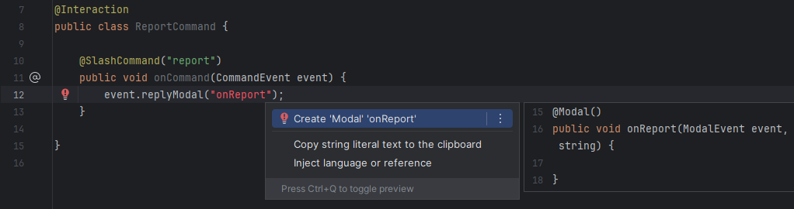

# Setup

## Prerequisites

- Java 25 or later
- [JDA 5.x](https://github.com/discord-jda/JDA)
- [SLF4J Implementation](https://jda.wiki/setup/logging/) _(not mandatory, but recommended)_

## Configuration
JDA-Commands is distributed through Maven Central. Alternatively you can download the latest version
[here](https://github.com/Kaktushose/jda-commands/releases/latest).

=== "Maven"
    ```xml title="pom.xml"
    <dependency>
       <groupId>io.github.kaktushose</groupId>
       <artifactId>jda-commands</artifactId>
       <version>4.0.1</version>
    </dependency>
    ```
=== "Gradle (Kotlin DSL)"
    ```kotlin title="build.gradle.kts"
    repositories {
       mavenCentral()
    }
    dependencies {
       implementation("io.github.kaktushose:jda-commands:4.0.1")
    }
    ```
=== "Gradle (Groovy DSL)"
    ```groovy title="build.gradle"
    repositories {
       mavenCentral()
    }
    dependencies {
       implementation 'io.github.kaktushose:jda-commands:4.0.1"'
    }
    ```

### Snapshots
Additionally to normal releases, snapshots of each commit to the main branch are published to maven central.

=== "Maven"
    ```xml title="pom.xml"
    <repositories>
        <repository>
            <url>https://central.sonatype.com/repository/maven-snapshots/</url>
        </repository>
    </repositories>
    <dependency>
        <groupId>io.github.kaktushose</groupId>
        <artifactId>jda-commands</artifactId>
        <version>4.1.0-SNAPSHOT</version>
    </dependency>
    ```
=== "Gradle (Kotlin DSL)"
    ```kotlin title="build.gradle.kts"
    repositories {
        maven("https://central.sonatype.com/repository/maven-snapshots/")
    }
    dependencies {
        implementation("io.github.kaktushose:jda-commands:4.1.0-SNAPSHOT")
    }
    ```
=== "Gradle (Groovy DSL)"
    ```groovy title="build.gradle"
    repositories {
        maven { url = uri('https://central.sonatype.com/repository/maven-snapshots/') }
    }
    dependencies {
        implementation 'io.github.kaktushose:jda-commands:4.1.0-SNAPSHOT"'
    }
    ```

## IntelliJ Plugin

We also provide an IntelliJ Plugin that performs some Code Inspection. It validates method references, which are 
commonly used in jda-commands. You can find it [here](https://plugins.jetbrains.com/plugin/25977-jda-commands-inspection).

 

