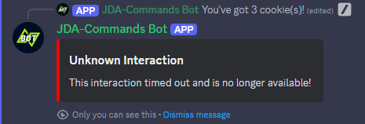

# Runtime Concept

## Overview

One of the core concepts in JDA-Commands is the so-called `Runtime`. It will be mentioned frequently here and in the 
[Javadocs](https://kaktushose.github.io/jda-commands/javadocs/JDAC_JAVADOC_VERSION/). A `Runtime` delegates the JDA events to their 
corresponding `EventHandlers` and manages the used virtual threads.

A new `Runtime` is created each time a:

- <SlashCommandInteractionEvent>
- <GenericContextInteractionEvent>
- <CommandAutoCompleteInteractionEvent>

is provided by JDA or if a component is marked as [*independent*](#independent).

Runtimes are executed in parallel, but events are processed sequentially by each `Runtime`.
Every `EventHandler` called by a `Runtime` is executed in its own virtual thread, isolated from the runtime one.

See [`Lifetime`](#lifetime) for details when a `Runtime` will close.

## Threading Model

JDA-Commands will listen for incoming events on the `JDA MainWS-ReadThread`. It will then create a new `Runtime`
or use an existing one, depending on the type of event _(see the flowchart below for details)._ The incoming event is 
then passed to the corresponding `Runtime`.

Each `Runtime` will run in its own virtual thread, called `JDAC Runtime-Thread <UUID>`. The `Runtime` will wait for new
incoming events and then delegate them to the correct `EventHandler`. For instance, a
<SlashCommandInteractionEvent>
will be passed to the `SlashCommandHandler`.

The `EventHandler` will _again_ run in its own virtual thread, named `JDAC EventHandler-Thread <UUID>`, isolated from 
the runtime one. Other incoming events are only executed when the previous one has finished. 

!!! tip "Blocking Methods"
    Because each event has its own virtual thread, you can call blocking methods like JDAs `RestAction#complete` safely
    without blocking the `JDA MainWS-ReadThread`.


## Lifetime

By default, JDA-Commands will handle the lifetime of Runtimes for you. Every `Runtime` will be closed if it has benn inactive for **15 minutes**. This time span is oriented towards the lifespan of the 
<InteractionHook>. 

### Explicit

You can disable the default behaviour by setting the 
<ExpirationStrategy> to 
<ExpirationStrategy#EXPLICIT>.


```java title="Main.java" 
JDACommands.builder(jda, Main.class)
        .expirationStrategy(ExpirationStrategy.EXPLICIT)
        .start();
```

This will prevent any `Runtime` from closing until <Event#closeRuntime()>
is explicitly called.

!!! example
    ```java title="GreetCommand.java" hl_lines="4"
    @Command("greet")
    public void onCommand(CommandEvent event) {
        event.reply("Hello World!");
        event.closeRuntime();
    }
    ```

### Inactivity
You can also adjust the time frame for a `Runtime` to be closed.

!!! example
    ```java
    JDACommands.builder(jda, Main.class)
            .expirationStrategy(new ExpirationStrategy.Inactivity(20))//(1)!
            .start();
    ```
    
    1. Note: the duration is always passed as minutes.

## Components and Modals

### Runtime-bound

By default, Buttons, SelectMenus and Modals are `runtime-bound`. This means that any incoming event will use the same
`Runtime` as the interaction that replied with them. 

However, this also means that they cannot be executed anymore after the `Runtime` is closed. JDA-Commands will handle 
that case and remove the component. It will also send an ephemeral reply to the user, saying that the 
component is no longer available.


/// caption
You can customize this error message, find more about it [here](../misc/error-handling.md#error-messages).
///

### Independent
You can also reply with components that are `runtime-independent`, making them virtually immortal. They will create a
new `Runtime` everytime they are executed. 

These components will even work after a full bot restart! If you want them to not be usable anymore you need to remove 
them on your own.

!!! info inline end
    Modals cannot be independent because they always need a parent interaction that triggers them!

!!! example
    ```java title="GreetCommand.java"
    @Command("greet")
    public void onCommand(CommandEvent event) {
        event.with().components(Component.independent("onButton")).reply("Hello World!");
    }
    ```
_Read more about building replies [here](../interactions/reply.md)._